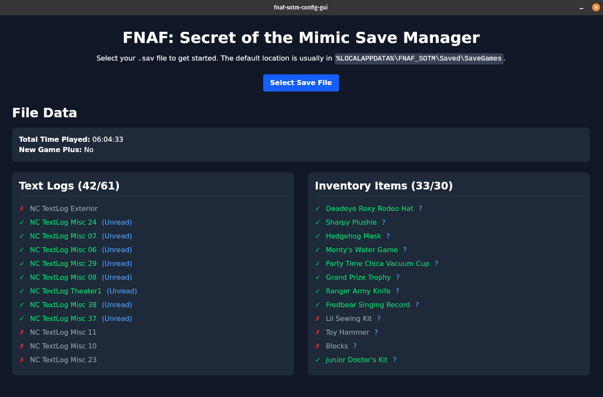

# FNAF: Secret of the Mimic - Config GUI

This is a GUI for the save file of FNAF: Secret of the Mimic game. It allows you to process your save file and see your progress.



## Features

- Process your save file and see your progress
- See your progress in the text logs and inventory
- See how to get your missing collectibles with an included guide

## How to use

Feel free to download the latest release from the [releases page](https://github.com/polvallverdu/fnaf-sotm-config-gui/releases).

You can also clone and build this project yourself:

```bash
git clone https://github.com/polvallverdu/fnaf-sotm-config-gui.git
cd fnaf-sotm-config-gui
bun i
bun tauri dev
```

It'll take a while to build the first time, but it'll be faster the next time.

## Contributing

This project is so uncomplete... I wanted to make something fast to see my progress easily, because I don't remember what I unlocked and what not 😅.

Some things I'd like to add:

- [ ] Images of the collectibles
- [ ] Editable config
- [ ] Maybe try to port to a website? (requires compiling gasv into a WASM package)
